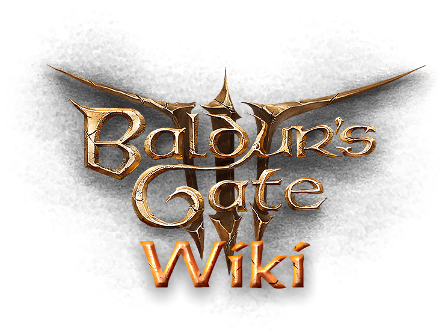

# Baldur's Gate 3 Wiki search

DISCLAIMER: I used the code written here: https://github.com/Project-Path-of-Exile-Wiki/poe-wiki-search and https://github.com/DAFF0D11/hard-redirect

- An easy to use search for information about the game using the [official community wiki](www.bg3.wiki).

- As part of an ongoing outcry over how terrible Fextralife is `https://baldursgate3.wiki.fextralife.com/` employing user-hostile and predatory approaches via tracking, fingerprinting and advertising, this extension instead redirects any browser sends to Fextralife's domain for `Baldur's gate 3` (A.K.A what section of the Fextralife wiki you were going to) and directs you to the community wiki instead, leaving you to land on the same exact page you were after, just in a friendlier, community-backed wiki.

## Is this extension safe?

Yes, it is. We do not enforce its use, we provide it as a means to simplify your life when searching for BG3 related information and as a means to globally redirect your requests to the official wiki, instead of the ad-ridden Fextralife site. The code that does this sits in two places:

- `background.js`
- `ui/ui.js`

Each file has a laymanised comment stack to walk even non-technical users through what it does and why. Don't be shy and read through!

## Do I _NEED_ this extension?

No, you can use whatever you like. This is for people who want to optimise their wiki searches.

## Do you collect any data?

Absolutely not. This extension does not need anything from you to work. The only thing it does is tell your browser to let it know when you click on any Fextralife link, and if this happens, it asks your browser to instead take you to the new community wiki. No other information is read, asked for or needed. At all.

## I want to contribute, how do I do this?

Just fork the repo, add your changes and submit a PR. I'm a developer but a lot of this was new to me so if you have improvements, reach out and I'd be happy to take criticism.

## Will this extension become bigger?

Probably not. It's meant to do a very specific thing and it mostly does that.

## Are you going to maintain this?

Yes, as long as the wiki is up, this should be something we actively maintain. Although it does not need much maintenance. It's a VERY small extension for now.
If for some reason, the community wiki becomes riddled with advertismenets or anything like that, I'll reroute to a different wiki or take this extension down.

